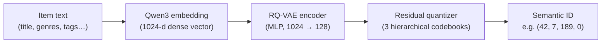
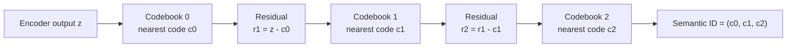
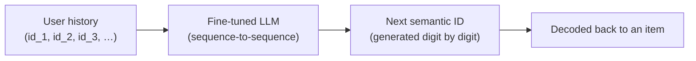

# LLM-based Recommender System with Semantic IDs

Master's thesis (TFM) project: a generative recommender for Steam games. Item
descriptions are embedded, then compressed into short discrete **semantic
IDs** with a Residual-Quantized VAE (RQ-VAE), so a language model can later be
fine-tuned to generate recommendations directly as sequences of these IDs
(TIGER-style), instead of scoring a fixed item catalog.

> Citations for the RQ-VAE / semantic ID / generative-retrieval literature to
> be added.

## How it works

Classic recommenders retrieve items by nearest-neighbor search over an
embedding index — the catalog has to be scored and indexed, and generalizing
to new combinations of items is hard. Following **TIGER**
(_Recommender Systems with Generative Retrieval_, Rajput et al.), this project
instead gives every item a short, semantically meaningful **ID** and trains a
language model to _generate_ the next item's ID directly, token by token,
like generating a word.

### 1. Turn each item into a semantic ID

An item's text (title, genres, description, tags) is embedded, then squeezed
through an RQ-VAE into a tuple of a handful of small integers — its semantic
ID. Items that are semantically similar end up with similar IDs.



### 2. Residual quantization builds a coarse-to-fine code

Each codebook level quantizes what the _previous_ level couldn't represent,
so early digits capture broad category and later digits refine within it —
similar to how the first digits of a zip code narrow down a region and the
rest pinpoint a street.



A 4th digit is appended only to break ties between the rare items that land
on the exact same (c0, c1, c2) — see `src/export_semantic_ids.py`.

### 3. Recommend by generating, not searching

A user's play history becomes a sequence of semantic IDs. A language model is
fine-tuned to read that sequence and generate the _next_ item's semantic ID,
one digit at a time — recommendation becomes sequence generation instead of
an index lookup over millions of item vectors.



This last stage (LLM fine-tuning on semantic-ID sequences) is not yet
implemented — see the [Pipeline](#pipeline) below.

## Pipeline

1. **Preprocessing** (`notebooks/preprocess_australian_data.ipynb`) — cleans
   the Australian Steam users dataset and the Steam games catalog into
   `data/clean_game_catalog.parquet` and per-user interaction sequences.
2. **Tokenize + embed items** (`src/build_game_embeddings.py`) — tokenizes
   item text and embeds it with `Qwen/Qwen3-Embedding-0.6B`, producing
   `data/output/games_with_embeddings.parquet`.
3. **Train RQ-VAE** (`src/train_rqvae.py`) — trains a hierarchical
   vector-quantized autoencoder on the item embeddings (encoder in
   `src/encoder.py`, quantizer in `src/vector_quantizer.py`, model in
   `src/rqvae.py`), logging to TensorBoard under `runs/` and checkpointing to
   `checkpoints/`.
4. **Export semantic IDs** (`src/export_semantic_ids.py`) — encodes every item
   with the trained model into a tuple of codebook indices (+ a
   disambiguation digit for collisions), saved to
   `data/output/semantic_ids.parquet`.
5. **Evaluate** (`notebooks/evaluate_semantic_ids.ipynb`) — checks codebook
   usage, ID collisions, and semantic coherence of the resulting IDs.
6. **LLM fine-tuning on semantic IDs** — not yet implemented.

## Setup

```bash
python3 -m venv .venv
source .venv/bin/activate
pip install -r requirements.txt
```

Requires Python 3.12. `data/`, `logs/`, `runs/`, and `checkpoints/` are
gitignored — place the raw/processed datasets under `data/` yourself.

## Usage

```bash
# 1-2: tokenize + embed the game catalog
python src/build_game_embeddings.py

# 3: train the RQ-VAE (hyperparameters in src/config.py)
python src/train_rqvae.py
tensorboard --logdir runs

# 4: export semantic IDs from the best checkpoint
python src/export_semantic_ids.py
```

Run the notebooks in `notebooks/` with Jupyter for preprocessing and
evaluation.

## Tests

```bash
pytest
```
